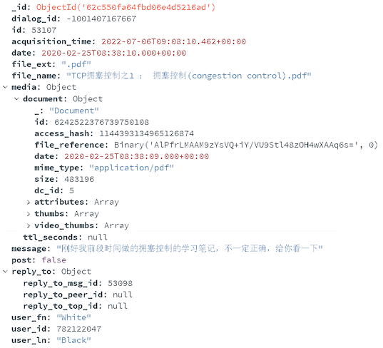
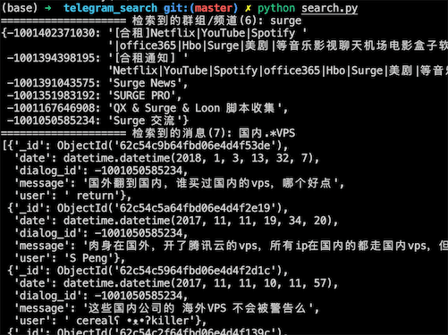
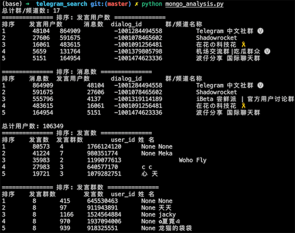
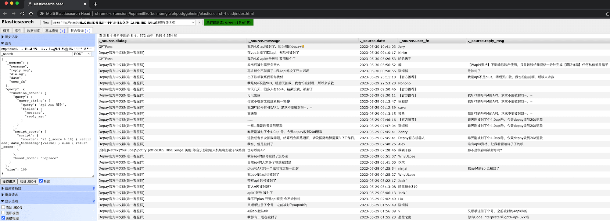
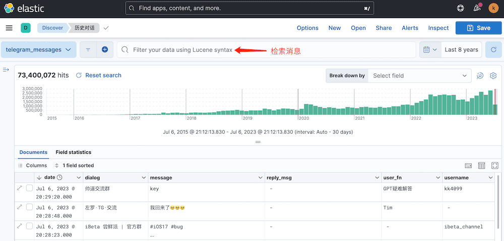
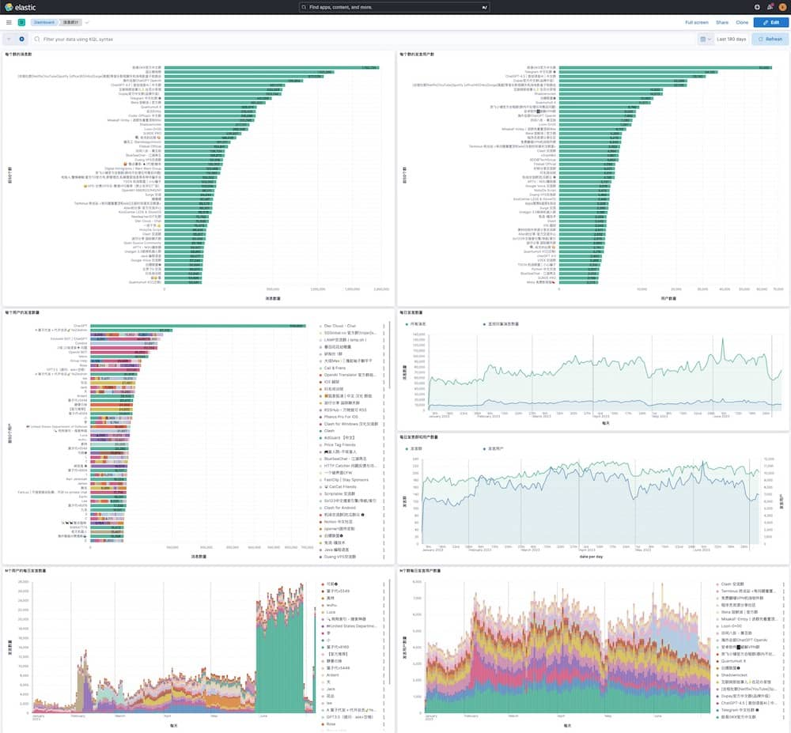

# 介绍
- 将自己加入telegram的所有群和频道(不包括机器人/用户对话等私密对话)的所有消息实时保存到数据库, 包括时间/内容/发表用户/转发回复/文件信息等等
- 可用于中文分词检索, 用户分析, 关键词触发提醒, 可视化分析, 大模型训练等等
- 保护隐私, 不记录下载所使用账号的相关信息
- 大约1万条消息1MB

# 教程
1. 前往 https://my.telegram.org 获取 api_id 和 api_hash
2. 安装 [mongodb](https://www.mongodb.com/try/download/community), 例如:
   - wget https://fastdl.mongodb.org/linux/mongodb-linux-x86_64-ubuntu2004-5.0.9.tgz
   - tar -xvf mongodb-* && cd mongodb-* && mkdir data
   - ./bin/mongod --dbpath ./data --bind_ip 0.0.0.0 --port 27017 --auth
   - ./bin/mongo
     - use admin
     - db.auth("user","password")
3. 将 config_example.jsonc 改名为 config.jsonc 并将其中的参数修改为自己的信息
4. 安装 python3, 执行 pip install -r requirements.txt 安装相关包
5. 执行 python -u data_to_mongo.py 实时获取群和频道消息到数据库. 终止后再运行会自动接着数据库中最新消息接着下载
   - 消息存储例子: 
6. 获取之后修改 search.py 中的检索正则, 然后执行 python search.py 测试检索
   - 例如: 
7. 用搜索到的 message 整句在客户端中检索找到上下文
8. 执行 python mongo_analysis.py 统计数据库中的群/频道和用户信息
   - 例如: 
9. 搭建带有中文分词的es并执行 python es_index.py 将数据索引在es中, 可以用 elasticsearch-head 进行检索
   - 例如: 
```json
{
  "_source": ["message", "reply_msg", "dialog", "date", "user_fn"],
  "query": {
    "function_score": {
      "query": {
        "query_string": {
          "query": "api AND 被封",
          "fields": ["message", "reply_msg"]
        }
      },
      "script_score": {
        "script": {
          "source": "if (_score > 10) { return doc['date_timestamp'].value; } else { return _score; }"
        }
      },
      "boost_mode": "replace"
    }
  },
  "size": 100
}
```

10. 搭建kibana进行检索和可视化分析
   - 检索:
      - 
   - 分析群/用户/消息:
      - 
